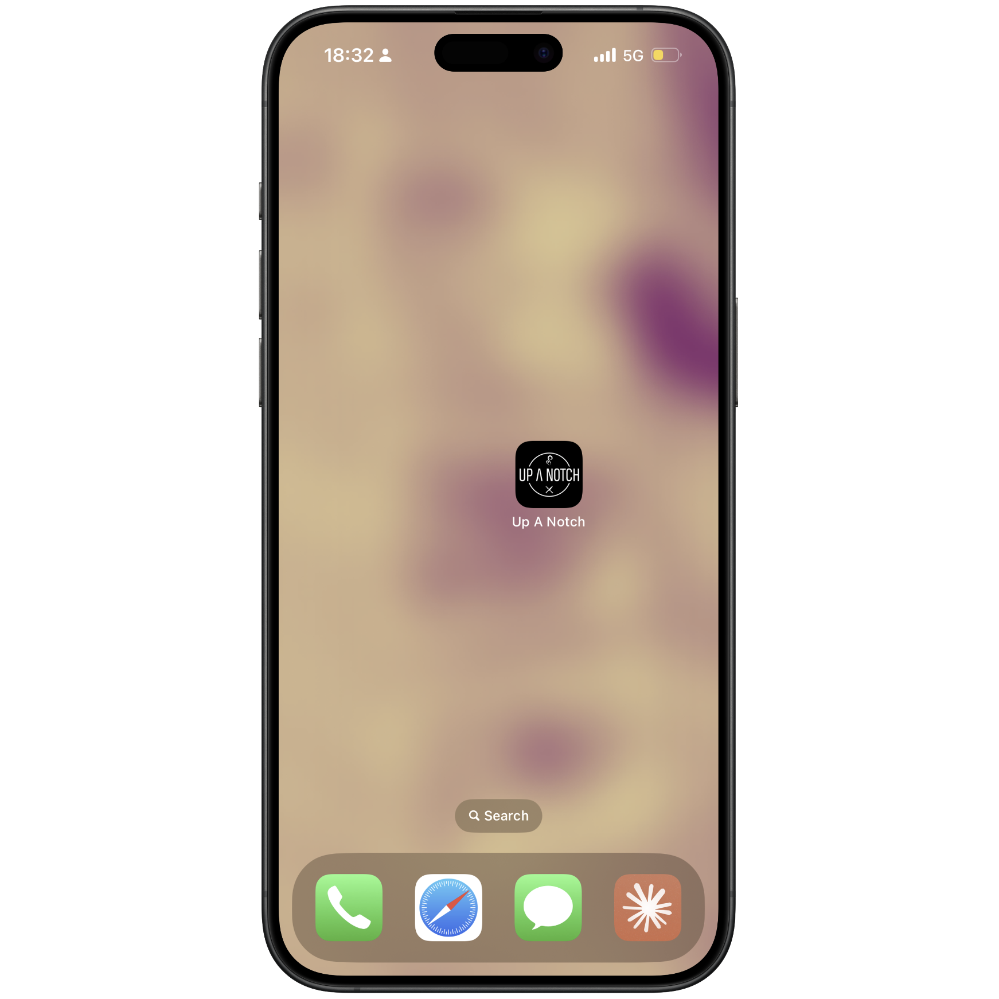
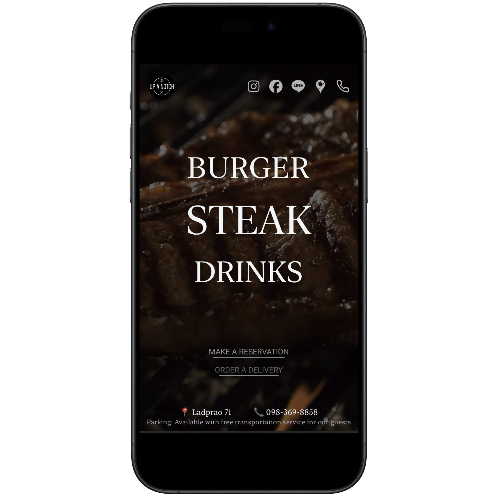
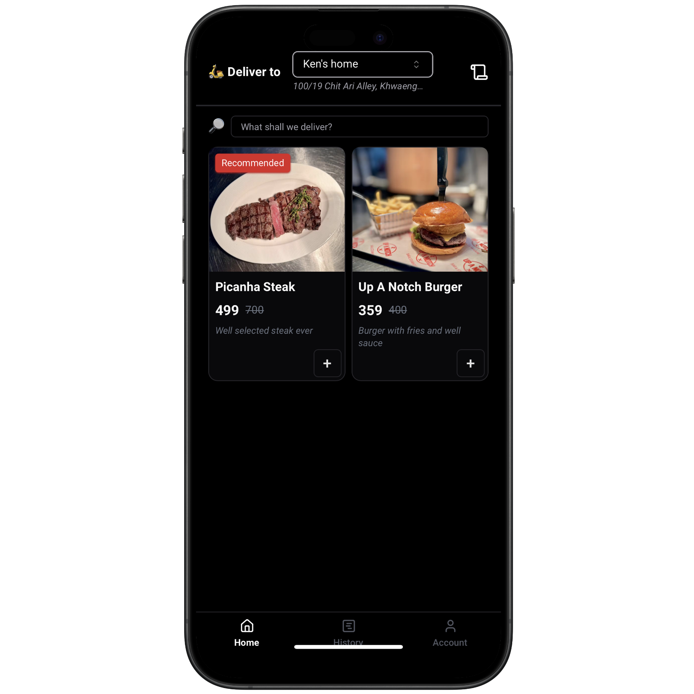
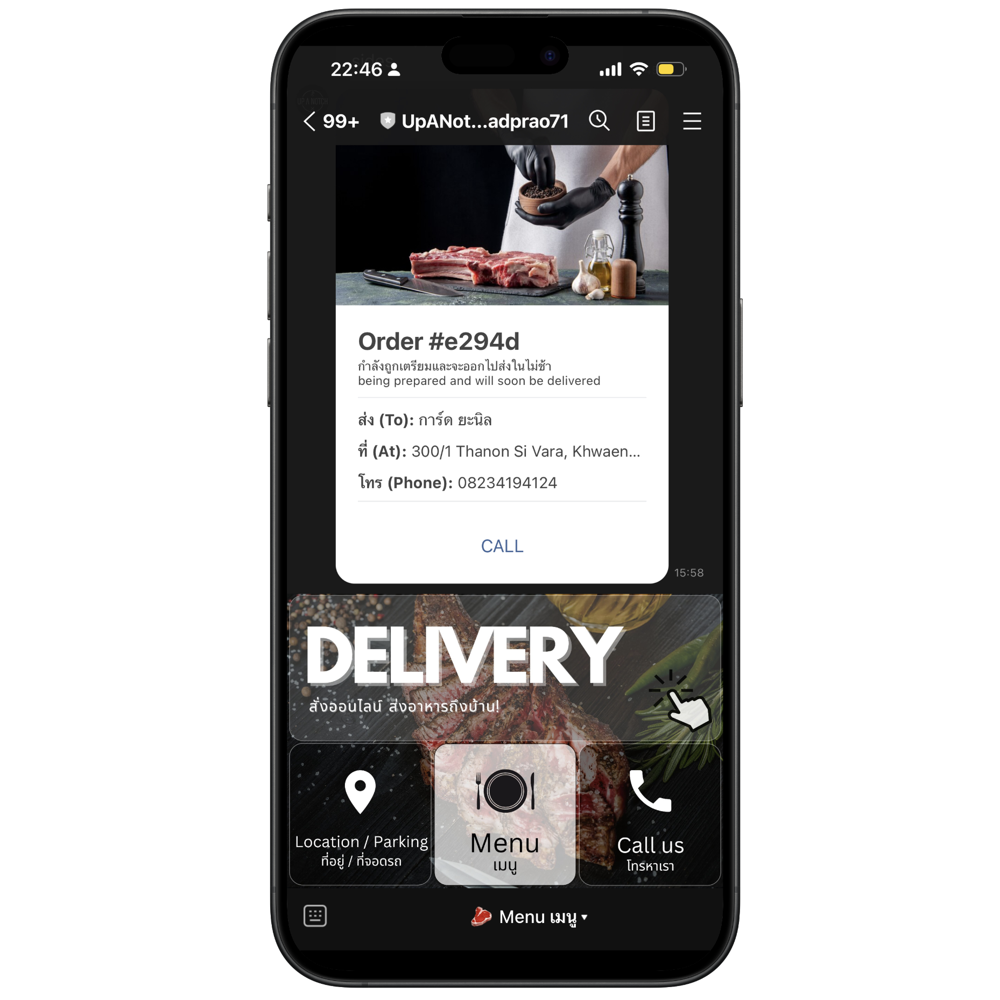

# UP A NOTCH LADPRAO 71 Delivery App

Welcome to the UP A NOTCH LADPRAO 71 Delivery App! This project showcases my ability to develop a complete delivery application from frontend to backend using a pure serverless architecture on Firebase.

## Live Demo

You can see the live application [here](https://upanotch-ladprao71.web.app/).

## Features

- **Serverless Architecture**: The entire application is built using Firebase, ensuring scalability and ease of maintenance.
- **Frontend Development**: A responsive and user-friendly interface for customers to place their orders.
- **Backend Development**: Efficient handling of orders, user authentication, and data storage.
- **LINE LIFF Integration**: Seamless integration with LINE LIFF for enhanced user experience.
- **Line OA Automation**: Automated responses and interactions using Line Official Account.
- **Rich Menu Setup**: Customizable rich menus for easy navigation and improved user engagement.

## Screenshots

Here are some screenshots of the application:

## Technologies Used

- **Firebase**: For serverless architecture, authentication, and database.
- **React**: For building the frontend user interface.
- **LINE LIFF**: For integrating with the LINE platform.
- **Line OA**: For automating interactions and setting up rich menus.

## About Me

I am a passionate developer with experience in building full-stack applications. This project is a testament to my skills in developing robust and scalable applications using modern technologies.

Feel free to reach out if you have any questions or would like to collaborate on future projects!
